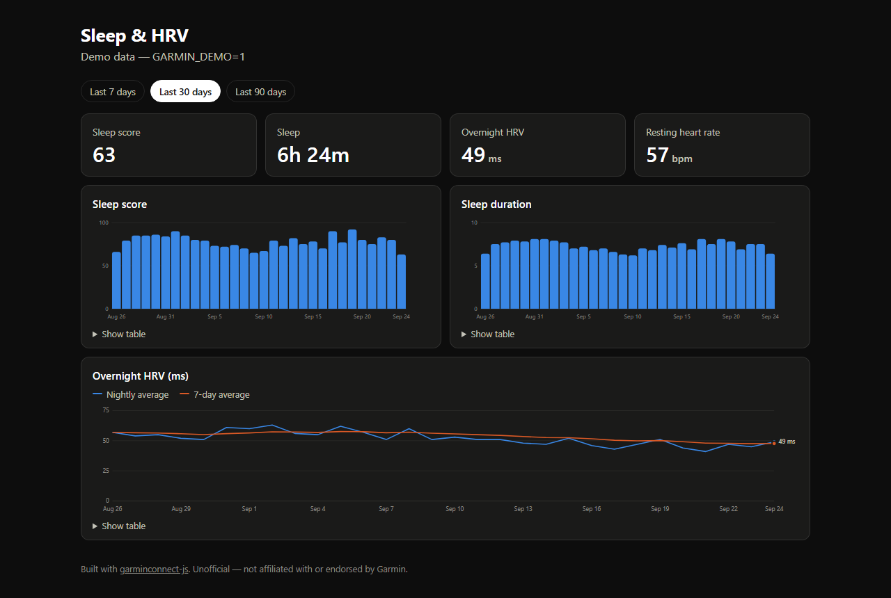

# Garmin sleep & HRV — a Next.js starter

A small Next.js app that signs in to Garmin Connect and charts your sleep score, sleep duration
and overnight HRV. It's built on [`garminconnect-js`](https://github.com/DynamicsNinja/garminconnect-js),
and it's meant to be copied: click **Use this template**, then make it yours.



<sub>**Unofficial.** Not affiliated with, endorsed by, or supported by Garmin. Garmin and Garmin
Connect are trademarks of Garmin Ltd. or its subsidiaries. The screenshot shows synthetic demo
data.</sub>

## What it shows

- **Last night at a glance:** sleep score, time asleep, overnight HRV and resting heart rate.
- **Charts for 7, 30 or 90 days:** sleep score, sleep duration, and nightly HRV against its 7-day
  average. Hover a chart for exact values, or open its table.
- **Sign-in with MFA:** if Garmin sends you a code, a second step asks for it.

Everything comes from a single library call, `garmin.getSleepDaily(start, end)`, which returns
one row per night with the score, duration, HRV and resting heart rate together. The charts are
plain SVG and add no dependencies.

## Run it

Needs Node 20.9 or newer (Next.js 16).

```bash
npm install
cp .env.example .env.local   # then set SESSION_SECRET — the file says how
npm run dev                  # http://127.0.0.1:3000
```

Sign in with your Garmin Connect email and password. Your password goes to Garmin's own sign-in
service and nowhere else; the app keeps only the OAuth tokens, in `.garmin-tokens/` (gitignored).
The tokens refresh themselves for about 30 days after your last use, then you sign in again.
**Disconnect** deletes them.

**No account handy, or taking screenshots?** Set `GARMIN_DEMO=1` in `.env.local` and the app shows
deterministic synthetic data instead of calling Garmin.

## Three modes

One environment variable decides how the app behaves:

| Mode | Set | Tokens live | For |
|---|---|---|---|
| **local** | nothing (default) | on disk, `.garmin-tokens/` | you, on your own machine |
| **public** | `GARMIN_PUBLIC=1` | in each visitor's browser, as an encrypted httpOnly cookie. **Nothing on the server.** | a shared deployment where anyone can try it with their own account |
| **demo** | `GARMIN_DEMO=1` | nowhere; sign-in is disabled | a synthetic-data showcase |

In public mode, visitors who aren't signed in see demo data with a **Sign in with Garmin** button.
The sign-in form says plainly where their password goes, and links to [`/privacy`](src/app/privacy/page.tsx),
which describes what the code does with their data. Each visitor's tokens are compressed and
sealed with `SESSION_SECRET` into a cookie in their own browser, so one visitor can never see
another's data, and the server holds nothing to leak. **Sign out** deletes the cookie. Sign-in
attempts are rate-limited to 5 per IP and 60 overall per 15 minutes. A public page that forwards
passwords to Garmin is attractive for credential stuffing, and Garmin would block the server's IP
for everyone.

## Deploy it (Dokploy, Coolify, Railway: anything with Nixpacks)

`nixpacks.toml` pins Node 22 and starts the server on `0.0.0.0:$PORT`. In a container, `npm start`'s
`127.0.0.1` binding would be unreachable.

1. Create an application from this repository, with **Nixpacks** as the build type.
2. Set the environment variables:
   - `SESSION_SECRET`: 32+ random characters (see `.env.example`). Changing it signs everyone out.
   - `GARMIN_PUBLIC=1` so visitors can sign in with their own account, or `GARMIN_DEMO=1` for demo only.
   - `PRIVACY_CONTACT` (optional): a contact line shown on `/privacy`.
3. Add a domain with HTTPS. The cookies are `Secure` in production, so they need HTTPS.
4. Run **one** instance. The rate limiter counts in memory; several replicas would each keep their
   own count, so share it through Redis before scaling out.

Garmin's sign-in sometimes refuses logins from cloud and datacenter IP ranges. If every sign-in on
your deployment fails while the same account works locally, that is the likely cause, not the code.

## How it's built

| File | What it does |
|---|---|
| `src/app/page.tsx` | The dashboard. A Server Component: it reads tokens, calls Garmin, and renders. |
| `src/app/actions.ts` | Server Actions for sign-in (including MFA) and sign-out, rate-limited in public mode. |
| `src/app/privacy/page.tsx` | The privacy note public mode links to. |
| `src/lib/mode.ts` | Picks local, public or demo mode from the environment. |
| `src/lib/garmin.ts` | The `GarminClient` and its token store. **The place to swap in your own storage.** |
| `src/lib/cookie-token-store.ts` | Public mode's `TokenStore`: compressed, sealed, chunked httpOnly cookies. |
| `src/lib/rate-limit.ts` | In-memory, per-IP and global sign-in limits. |
| `src/lib/seal.ts` | AES-256-GCM sealing for the MFA and token cookies. |
| `src/lib/sleep.ts` | Flattens `getSleepDaily` rows into the `Night` shape the page uses. |
| `src/components/charts.tsx` | Dependency-free SVG column and line charts, with hover and table views. |

The library only runs on the server: it uses `node:crypto`, and your tokens must never reach the
browser. Everything that touches Garmin lives in Server Components and Server Actions.

### MFA across two requests

`client.login()` doesn't block waiting for a code. It returns `{ state: "mfa_required", mfaState }`,
and the app finishes later with `client.resumeLogin(mfaState, code)`, in a different request.
`mfaState` holds no password, but it is a live, half-finished sign-in, so the app encrypts it into
an httpOnly cookie that expires after 10 minutes and deletes it as soon as it's used.

## Building a real product on it

Public mode is enough for letting people try the library. For an app with its own user accounts:

1. **Add your own authentication.** In local mode, anyone who can reach the app sees the connected
   account's data, which is why `npm run dev` and `npm start` listen on `127.0.0.1` only.
2. **Store tokens per user, in your database.** Replace the token store in `src/lib/garmin.ts`
   with a `TokenStore` keyed by your user id. It is a three-method interface: `load`, `save` and
   `clear`. Persist the whole token object, and keep `expires_at` and `refresh_token_expires_at` as
   numbers, because every refresh decision reads them. Serverless hosts have no persistent disk,
   so the file store won't work there.
3. **Build one `Garmin` per user and reuse it.** Each new instance costs an extra profile fetch.

EU accounts: Garmin rejects every *write* with HTTP 412 until upload consent is granted in Garmin
Connect's settings. This starter only reads, so it's unaffected.

## Going further

The library has 164 typed methods: activities, training readiness, body battery, workouts,
courses and more. See its [API reference](https://github.com/DynamicsNinja/garminconnect-js/tree/main/docs/api).
Adding a chart usually means one more call in `page.tsx` and another chart component.

## License

MIT.
